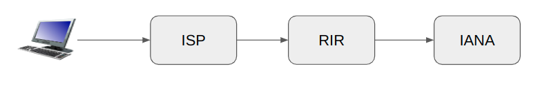

# Конспект курса Компьютерные сети
Конспект составлен по курсу лекций, читаемому на ПМИ в ИТМО весной 2022 года.

[Плейлист с лекциями](https://youtube.com/playlist?list=PLd7QXkfmSY7bh7nHfBbeQDIUUWueQja_4)

Если вы увидели ошибку или неточность, пожалуйста, сообщите об этом и предложите исправление, например, добавив Issue на Гитхабе, или создав пул-реквест.


# Лекция 1
[Youtube](https://youtu.be/jzvWO9u1t9I)

Полезная литература:
- *Computer Networks.
Andrew Tanenbaum, David Wetherall*
- *Computer Networking: A Top-down Approach.
  Jim Kurose*

## Как заставить компьютеры общаться?
### 1 способ
Соединить их проводом.

Проблема - N^2 проводов.
### 2 способ. Circuit Switching
Поставить промежуточные узлы, которые будут замыкать провода. Называется "Канальная коммутация"

Проблема - большую часть времени канал простаивает. Мы передали сообщения и больше ничего не делаем, хотя используем канал. Хочется, чтобы через один канал общалось сразу несколько пользователей.
### 3 способ. Packet switching
Разобьем данные на маленькие пакеты, в которых напишем, от кого и кому они предназначены. Пакеты достаточного маленького размера (обычно не больше 1.5 Кб), поэтому по проводу передаются быстро.

Решили основную проблему - теперь каналы не простаивают.
## Немножко терминологии
- Hosts, Хосты - устройства, посылающие данные. Располагаются в "листьях" графа интернета: телефоны, компьютеры.
- Packet switches, коммутаторы - пересылают пакеты
- Communication links - соединения, линки, через которые идут данные
- Networks, сети - множество устройств, коммутаторов, линков, управляемые одной организацией

**Интернет - объединение многих независимых сетей, которые как-то общаются друг с другом**

## Скорость передачи данных
### Capacity, link bandwidth, link transmission rate
Кол-во бит в секунду, которое способно передавать соединение. Ограничивается например тем, что чтобы передать сигнал по оптоволокну, нужно светить какое-то продолжительное время.
### Packet transmission delay
Задержка между отправлением и получением первого пакета данных.

Ограничивается:
- Скоростью света. Нельзя передать сигнал в Америку из России быстрее 200мс
- Размером пакета и link bandwidth

*packet transmission delay = packet size / transmission rate*

Пакеты обычно начинают передавать, получив их полностью. Поэтому время для передачи пакетов ограничивается снизу
```
числом узлов * packet transmission delay
```
Поэтому чем больше узлов тем хуже.

## Link, Линки
### Витая пара
Два разделенных медных провода.
- Category 5: 100 Mbps, 1 Gbps Ethernet
- Category 6: 10 GBps Ethernet


### Coaxial cable


На заре интернета много работало через коаксиальный кабель.
### Fiber optic cable, Оптика

Стекловолокно, по которому летят фотоны.
- Высокая скорость
  - 10's-100's Gbps
- Low error rate. Устойчивость к помехам
  - Иммунитет к электромагнитному шуму
  - Повторители расположены далеко друг от друга.

### Wireless radio. Беспроводная связь
- Передача сигнала по воздуху
- Чувствителен к отражениям, преграждающим путь предметам. другому шуму.

Виды:
- Wireless LAN (WiFi)
  - 10-100's Mbps; 10's of meters
- wide-area (4G, 5G cellular)
  - 10's Mbps over ~10 Km (c 5G гораздо больше)
- Bluetooth: замена кабелям
  - short distances, limited rates
- terrestrial microwave.
  - point-to-point; 45 Mbps channels
- satellite
- up to 45 Mbps per channel
  - 270 msec end-end delay (Starlink быстрее)

## Две задачи в компьютерных сетях
Forwarding и Routing (маршрутизация)
- Forwarding - локальное принять решение, кому переслать пакет дальше. Коммутатор, занимающийся форвардингом может не знать о глобальном устройстве сети.
- Routing - нахождение глобальных путей между отправителем и получателем. Создание таблиц маршрутизации.

## Packet-switching: queueing.

В роутерах есть буфер-очередь для пакетов. Если пакеты приходят быстрее, чем роутер может их переслать, то они неизбежно начнут теряться.

Поэтому нужно регулировать скорость отправки пакетов. Эта проблема называется **Congestion control**. Ей занимается ряд протоколов, например, TCP.

## Протокол
Протокол - договор между двумя или более сторонами (программами, людьми, узлами) о том, как им общаться друг с другом.

### Откуда берутся протоколы? Интернет стандарты
- RFC: Request for Comments
- IETF: Internet Engineering Task Force
- ISO: International Organization for Standardization

Обычно умные люди собираются и придумывают новый стандарт, но он помечается как черновик, draft. И дальше может собраться еще одна группа умных людей, и утвердить предложенный стандарт.

## Layered Internet protocol stack
Слоеный стек интернет-протоколов.
- **application:** То, ради чего происходит общение.
  - HTTP, IMAP, SMTP, DNS
- **transport:** process-process data transfer. Передача данных.
  - TCP, UDP
- **network:** транспортировка пакетов от отправителя до получателя.
  - IP, routing protocols
- **link:** передача данных между соседними узлами сети
  - WiFi, Ethernet, PPP
- **physical:** биты "по проводу"

Дальше в курсе будет рассказано о границе между *physical* и *link*. Вкратце, link это логический уровень.

### Модель песочных часов

На самом деле DNS может работать поверх TCP, а HTTP поверх UDP, и др.

### ISO/OSI model (ЭМВОС)
- L7: application
- L6: presentation
- L5: session
- L4: transport
- L3: network
- L2: link
- L1: physical

Модель была придумана до создания интернета, поэтому она не совсем соответствует тому, как он работает.

Смысл разделения всего на слои в том, чтобы разные слои могли работать, не зная про внутреннее устройство друг друга. HTTP не важно, он доставляет сообщения через WiFi или Ethernet. А IP пакетам не важно, что лежит внутри них (UDP или TCP).

Хотя, часто бывает, что протоколы лезут не на свой уровень. Например, протокол L2 смотрит на IP адрес.

# Лекция 2

[Youtube](https://youtu.be/NtTF7ckApkE)

## IP
- IPv4
  - 32 bits
  - 87.250.250.242
- IPv6
  - 128 bits
  - 2a02:06b8:0000:0000:0000:0000:0002:0242
  - 2a02:6b8::2:242
  - ::ffff:87.250.250.242

:: означает много нулей.

### IP Network (IP сеть)
- 87.250.250.0/23

IP адрес с некоторым зафиксированным префиксом является IP сетью. Она задает множество используемых IP-адресов.

|           |                 |                                      |
| --------- | --------------- | ------------------------------------ |
| Address   | 87.250.250.0    | 01010111.11111010.1111101 0.00000000 |
| Netmask   | 255.255.254.0   | 11111111.11111111.1111111 0.00000000 |
| Wildcard  | 0.0.1.255       | 00000000.00000000.0000000 1.11111111 |
| Network   | 87.250.250.0/23 | 01010111.11111010.1111101 0.00000000 |
| HostMin   | 87.250.250.1    | 01010111.11111010.1111101 0.00000001 |
| HostMax   | 87.250.251.254  | 01010111.11111010.1111101 1.11111110 |
| Broadcast | 87.250.251.255  | 01010111.11111010.1111101 1.11111111 |

Нулевой адрес сети является специальным, зарезервированным. Это идентификатор сети.

**Исключение:** в сети `/31` можно использовать оба адреса.

### IP Network (Routing, Маршрутизация)
На самом деле это Forwarding, но эти термины считаются взаимозаменимыми.
```
192.168.99.0/24 dev wlan0
0.0.0.0/0 via 192.168.99.1
```
- Если пришел пакет по любому адресу из `192.168.99.0/24`, то отправь его по WiFi
- Иначе отправь на `192.168.99.1`

При принятии решения, куда отправлять пакет, выбирается строка с наиболее длинным совпавшим префиксом, т.е. самое точное совпадение.

**Примеры**
```
10.0.0.0/8 via 192.168.1.1
10.1.0.0/16 via 192.168.1.2
10.1.2.0/24 via 192.168.1.3
```
- `10.1.3.0` пойдет во вторую строку.
- `10.200.1.1` пойдет в первую

## Как получить IP адрес?
Никак. Они кончились :)

**Как это работало раньше, и как это работает для IPv6 адресов?**

- Regional Internet Registry
  - RIPE NCC - RIR в Европе
- Internet Assigned Numbers Authority (IANA)



IANA выдает IP-адреса. Но не пользователям напрямую. Она может взять подсеть (`5.0.0.0/8`) и разрешить некоторому RIR (RIPE NCC) выдавать адреса из этой подсети.

Провайдер может обратиться к RIR и попросить выдать адреса. RIR тоже выбирает достаточную по размеру подсеть и отдает провайдеру.

*Существует стратегия: выдать подсеть, а вместе с ней зарезервировать кусочек, следующий за выданным (если организация попросит) на случай, когда организация вырастет и ей потребуется больше IP адресов. Так получится выделить один непрерывный блок вместо двух раздельных. Это полезно, так как таблица маршрутизации будет меньше.*

На данный момент (июнь 2022 года) любой IPv6 адрес выдается из `2000::/3` подсети. Так сделано для того, чтобы если что-то пойдет не так, то было еще 7 вариантов попробовать сделать по-другому.

### Использование IPv6 адресов
https://www.google.com/intl/en/ipv6/statistics.html

Примерно 40% устройств (пользователей Google) поддерживают IPv6.
Есть несколько преград при внедрении IPv6:
- Оборудование должно его поддерживать
- Софт тоже должен поддерживать
- Не приносит выгоды компаниям. Для них это просто стремление к хорошему будущему.
- Провайдерам могут запрещать выдавать IPv6, т.к. важное оборудование для слежки его не поддерживает (см. СОРМ).

### IPv6 Allocation
Выдача IPv6
- `2000::/3`
- /48 минимальный размер (48 и больше) подсети.
  - Если ты крупный, то могут дать /32.
- Принято любому устройству выделять /64 подсеть, чтобы у него было пространство для маневров внутри себя (для виртуальных машин).

### Специальные (зарезервированные) IP адреса
- Loopback. Отправить себе же
  - 127.0.0.0/8
  - ::1/128
- `0.0.0.0/8`. Этих адресов не существует. То есть устройство с таким адресом "оффлайн", не подключено ни к какой сети.
  - 0.0.0.0/8
  - ::/128

Еще, при создании TCP / UDP сервера, указывают, на каком адресе слушать. Если указать `0.0.0.0`, то будут приходить все пакеты, отправленные вашему компьютеру (у компьютера может быть несколько IP-адресов).

### Специальные IP адреса. Private IP Addresses (IP адреса для локальной сети)
- 192.168.0.0/16
- 172.16.0.0/12
- 10.0.0.0/8
- 100.64.0.0/10
- ~~fec0::/7~~
- fd00::/8

Их можно использовать для построения своей локальной сети.

**fd00::/8**

Первые 8 бит фиксируются: `fd`. Дальше генерируются 40 случайных бит, и к ним приписывается 16 бит на усмотрение. Получается `/64` подсеть, которую можно использовать как угодно. Она уникальна в интернете, но не маршрутизируема (не видна для интернета).

Случайность нужна для того, чтобы можно было запросто подключаться к двум таким сетям, не переживая, что они совпадут.

## NAT (Network address translation)


`10.0.0.2` хочет отправить пакет `8.8.8.8`.

1. Пакет доходит до роутера, `10.0.0.1`
2. Роутер не может отправить пакет в интернет с адресом отправителя `10.0.0.2`, так как это **серый** адрес. Изменяет src адрес на **белый** `5.6.7.8`, отправляет в интернет
3. Приходит ответ вида `8.8.8.8 -> 5.6.7.8`
4. Роутер в замешательстве, пакета не ждал.

Поэтому существует NAT, который работает следующим образом:

Знаем, что внутри IP пакета лежит либо TCP, либо UDP. Соответственно там есть порт отправителя и получателя:

| src      | dst     |
| -------- | ------- |
| 10.0.0.2 | 8.8.8.8 |
| 1234     | 53      |

Роутер заменяет:
- src порт на новый случайный уникальный порт
- src адрес на свой белый

| src     | dst     |
| ------- | ------- |
| 5.6.7.8 | 8.8.8.8 |
| 777     | 53      |

Добавляет в хеш-таблицу значение `(10.0.0.2, 1234)` по ключу-пятерке:
|               |         |
| ------------- | ------- |
| TCP (или UDP) |         |
| 5.6.7.8       | 8.8.8.8 |
| 777           | 53      |

Потом от `8.8.8.8` приходит пакет:

|               |         |
| ------------- | ------- |
| TCP (или UDP) |         |
| 8.8.8.8       | 5.6.7.8 |
| 53            | 777     |

и роутер, смотря в хеш-таблицу, определяет, кому предназначен пакет.

Но в реальном мире у роутера скорее всего тоже серый IP-адрес. Поэтому NAT-илка может стоять и у провайдера, к которому подключен роутер.

*Можно узнать путь до желаемого IP-адреса с помощью утилиты `tracert`/`traceroute`.*

### Специальные IP адреса. Link-local.
- 169.254.0.0/16
- fe80::/10

Адреса, которые создаются автоматически при соединении устройств по проводу. Они локальны, но с помощью них можно общаться. Еще по ним можно понять, что сеть не настроена.

### Специальные IP адреса. Broadcast.
- 87.250.250.0/23
  - 87.250.251.255 - Directed broadcast
- 255.255.255.255/32 - Local network broadcast

Если на этот адрес отправить пакет, то он перешлется всем компьютерам в данной сети.
- Directed broadcast не работает никогда (кроме случая, когда src и dst адрес пакета находятся в одной сети)
- Local network broadcast пересылает пакеты всем внутри сети (ближайшей, непосредственной).

### Специальные IP адреса. Multicast
- 224.0.0.0/4
  - 224.0.0.1
- ff00::/8

Создан для отправки пакетов многим, но не всем. Почти не используется.
Есть специальные протоколы, которые позволяют подключиться к мультикасту, и все, что придет на некоторый адрес внутри `224.0.0.0/4` будет отправлено заинтересованным.

## IP Packet


IP пакет = заголовок + данные

### Поля IPv4 пакета
#### Version
Версия пакета:
- IPv4
- IPv6

Нужно для того, чтобы, например, WiFi при отправке пакета мог узнать, кому его передавать, обработчику IPv4 или IPv6
#### IHL
Internet Header Length
- Сколько 32-битных слов в заголовке

#### Total Length
Размер IPv4 пакета (включая заголовок)

#### Про фрагментацию
IPv4 пакеты умеют делиться пополам, чтобы пролезать через узкие каналы.
- Identification: идентификатор, какому пакету принадлежит фрагмент
- Flags
  - MF: после данного фрагмента должны идти еще фрагменты
  - DF: Do Not Fragment. Если выставлен и пакет не пролезает, то выкинуть его, и опционально отправить назад сообщение о неуспешной доставке.
- Fragment Offset: позиция в массиве данных (считается в 32-битных словах).

**Пример фрагментации:**

Был большой пакет:
```
MF = 0; FO = 0; Id = x = rnd()
```
Разделился на два:
```
1. MF = 1; FO = 0; Id = x
2. MF = 0; FO = 1 * <длина пред. фрагмента>; Id = x
```
Фрагментация создает большую проблему: как понять, что фрагмент потерялся и никогда не дойдет? Никак, только с помощью таймеров.

С этим связана атака на сервер: можно отсылать только первый и третий фрагмент, а второй дропать.

Есть ровно одно хорошее решение: если пришел фрагмент, выкидывать его.

#### Time To Live (TTL)
Уменьшается, когда пакет посещает промежуточный узел. Если обнулилось, то пакет выкидывается.

Предназначено для борьбы с затерявшимися, ходящими по кругу пакетами.

*Как хакнуть запрет на раздачу интернета у Yota?*

Yota проверяет, что все пакеты имеют одинаковый TTL (или что TTL является степенью двойки). Если вы раздаете интернет на компьютер, то TTL пакетов с компа будет на 1 меньше.

Решение: поставить вручную TTL на компе на 1 больше.

*Комментарий: диаметр интернета в узлах примерно равен 40.*

#### Header Checksum
Некоторый хеш от всего заголовка кроме TTL. **Только от заголовка!!!**

#### Type of Service
Насколько важно содержимое пакета.

**ECN** - *Explicit Congestion Notice*, флажочек внутри Type of Service, которым можно помечать обратные пакеты, если происходит Congestion. Нужен для того, чтобы явно сообщать о невозможности передачи пакетов с текущей скоростью (например, буфер переполнился или скоро переполнится). Тогда тот, кто его увидит, должен начать слать пакеты помедленнее.

Например, пакеты, отвечающие за функционирование сети довольно важные.

Нет единого протокола работы с Type of Service, логика работы локальна для каждой сети.

### Поля IPv6 пакета
#### Next Header
- TCP
- UDP
- IP Extension
  - Jumbogram. Позволяет использовать пакет увеличенного размера. Размер обычного пакета ограничивается размером поля `Payload Length`
#### Payload Length
Размер данных после заголовка.

#### Hop Limit
Аналог TTL

#### Traffic Class
Аналог Type of Service

#### Flow Label
Иногда хочется, чтобы пакеты шли в одном порядке, одним маршрутом. Например, в TCP соединении. Тогда в Flow label можно записать случайное число, равное для всех нужных пакетов.

Тогда, если это число не 0, роутеры могут стараться слать пакеты с одинаковым Flow Label (и одинаковым получателем, отправителем) одним маршрутом.

### Про размеры IP пакетов
Любая сеть должна поддерживать передачу
- IPv4 пакетов размером 768Б
- IPv6 пакетов размером 1280Б

WiFi и витая пара по умолчанию не умеют пересылать пакеты больше 1506Б. Для больших пакетов нужно настраивать сеть специально.

Максимальный размер пакета, который можно передать, называется **MTU (Maximum Transmission Unit)**.

### Path MTU Discovery
Узнать MTU на пути до получателя. Можно использовать бинпоиск, выставив флаг DF.


# Лекция 3
[Youtube](https://youtu.be/7frowBc80vg)
## ICMP
Протокол для контроля за доставкой пакетов. Работает поверх протокола IP.
### Echo request, Echo reply
Простейший обмен сообщением, используется утилитой `ping`.
### Destination Unreachable
Место назначение недоступно. Может быть ответом на любой запрос. Виды ответов и причины:
- Fragmentation required
- Destination host unreachable
- Destination network unreachable. Провайдер не может отправить сообщение другому провайдеру
- Destination port unreachable. Пакет дошел до компьютера, но его не получилось отдать протоколу верхнего уровня, например, TCP, потому что этот пакет никто не ждал.
- *administratively prohibited
### Time Exceeded
TTL обнулился

### ~~Traceroute~~
Раньше был такой вид сообщений, который требовал всем промежуточным узлам отправить ответ. Плох тем, что на один пакет генерируется столько пакетов, сколько узлов. Плюс можно в src IP указать чужой IP адрес и атаковать кого захотим. Поэтому Traceroute убрали.

Все ответы ICMP может отправить любой узел на пути до получателя. Если вы отключены от интернета, то ваш же компьютер и ответит вам этим сообщением.

ICMP так устроен, что ответ не может быть больше запроса. Поэтому, если вы хотите, получить какой-то большой ответ, то нужно добавить к запрос большой паддинг нулями.

*Забавное замечание: не нужно (и никто так не делает) слать ICMP пакет в ответ на ICMP пакет. Иначе пакет с сообщением "Destination unreachable" будет гулять по сети бесконечно.*

## NAT64
О том, как устройства IPv4 без IPv6 могут общаться с устройствами IPv6. Принцип похож на NAT.

## Полезные Утилиты
### Whois
Утилита, позволяет по IP адресу узнать:
- Кому он принадлежит (компанию, которой RIR выдал IP адрес)
- Сеть, которой он принадлежит
- Номер автономной системы
- Адрес, куда жаловаться на abuse
- Прочая информация

### Tcpdump
Показывает все проходящие через вас пакеты.

### Wireshark
Позволяет подключиться к интерфейсу и смотреть, что за трафик идет через этот интерфейс.

## Ethernet и Wi-Fi
| Ethernet                       | Wi-Fi       |
| ------------------------------ | ----------- |
| IEEE 802.3                     | IEEE 802.11 |
| MAC address: 48:8f:5a:69:58:97 |             |
| Broadcast: ff:ff:ff:ff:ff:ff   |             |


- EtherType - тип данных, который лежит внутри (IP, ARP, др.).
- Локальная сеть, место, где работает адресация, называется Ethernet сегментом.
- Ограничение размера около пакета - примерно 1.5 КБ.

### Передача данных в Ethernet
- Хаб (Hub)
  - L1
  - Просто повторяет входящий сигнал подключенным устройствам. Получил единичку - отправил единичку.
  - Сейчас почти не используется, т.к. низкая скорость, много проблем
- Коммутатор aka Считч, Switch
  - L2
  - Хранит список MAC-адресов подключенных к нему устройств, и таким образом определяет, в какой порт (физический) переслать пакет.
  - До того, как новое подключенное устройство отправит пакет, коммутатор о нем не знает.
  - Если коммутатор подключен к другому коммутатору, то он узнает, какие MAC-адреса доступны другому, и пересылает ему соответствующие пакеты.
- Маршрутизатор
  - L3
  - Отличается от свитча тем, что работает на уровне IP.
  - **Очевидно, но важно: каждый роутер по пути переписывает и mac отправителя на свой, и mac получателя на адрес выбранного next hop**

#### Циклы в Ethernet-сети


`A`, если хочет послать пакет клиенту `7`, будет отправлять их и `B`, и `C`. Скорее всего, после появления цикла сеть перестанет работать.

Как решать эту проблему?
- Не надо создавать цикл
- Если один MAC-адрес становится доступен из двух портов, то коммутатор отключает один из этих портов.
  - Не очень, потому что `B` отключится (WHAT??? TODO: а чем лучше следующий способ?)
- Если пакет, который мы пересылаем, вернется к нам, то отключим порт, по которому пакет вернулся.
  - Можно периодически пытаться включать порт и смотреть, починилась ли сеть.
- Существуют умные алгоритмы для больших датацентров, для которых важно наличие нескольких путей между устройствами при единовременном использовании лишь одного из них.

## MAC-48 address


Хочется, чтобы MAC адреса были глобально уникальными. Как этого добиваются:

Организации (например, производители сетевых карточек) обращаются к IEEE и получают уникальный идентификатор, первые три октета. А дальше внутри организации используются 2^24 различных MAC-адресов. Это не очень много, поэтому когда адреса кончаются, поступают одним из способов:
- Получают еще один идентификатор
  - Сложный процесс
- Переиспользуют свои MAC-адреса
  - Нужно надеяться, что внутри одной Ethernet-сети два одинаковых MAC-адреса не появятся.

### Специальные битики в первом октете идентификатора
- `b0` (на картинке сверху)
  - 0: unicast. Обычный MAC-адрес
  - 1: multicast. Адрес для отправки пакетов на множество других MAC-адресов. Используется редко.
- `b1`
  - 0: глобально уникальный (OUI enforced)
  - 1: локально созданный.

Виртуальные машины тоже имеют MAC-адреса. Их выделяет система виртуализации, которой тоже когда-то был выдан идентификатор.

## ARP (Address Resolution Protocol)
По IP адресу бывает нужно узнать MAC-адрес.

Вспомним таблицу маршрутизации:
```
> ip r
default via 192.168.0.1 dev wlp0s20f3 proto dhcp metric 600
169.254.0.0/16 dev virbr0 scope link metric 1000 linkdown
...
```
*Кстати, default эквивалентно 0.0.0.0/0.*

`169.254.0.0/16 dev virbr0` означает отправить пакет на устройство `virbr0`. Но чтобы то сделать, нужно знать, на какой MAC-адрес отправлять пакет.

### Как работает ARP?
- На устройстве заполняется табличка `IP -> MAC`.
- Чтобы узнать неизвестный MAC адрес, на **Ethernet-Broadcast** адрес посылается специальный ARP-пакет с вопросом "У кого данный IP адрес".
- Как только приходит ответный пакет, устройство узнает искомый MAC-адрес.
- Табличка периодически обновляется, т.к. MAC-адрес может измениться, или устройство в принципе перестанет быть доступным.

## ND (Neighbor Discovery Protocol)
Решает ту же задачу, что и ARP, только работает поверх IP (ICMP). Умеет в IPv6, в отличие от ARP.
|             |                     |
| ----------- | ------------------- |
| `<src MAC>` | `ff:ff:ff:ff:ff:ff` |
| `<src IP>`  | `<dst IP>`          |
- Address resolution. Пакеты:
  - Neighbor Solicitation (досл. вымогательство адреса)
  - Neighbor Advertisement

Кроме этого протокол ND умеет:
- Router discovery. Узнавать, кто является роутером в вашей сети. Пакеты:
  - Router Solicitation
  - Router Advertisement
- Redirection. Сказать, что я больше не роутер, роутер вот он, шли пакеты ему. Пакет:
  - Redirect

## DHCP
Когда клиент подключается к сети, ему необходимо получить IP адрес. Он может сделать это вручную. Либо, если в сети есть DHCP сервер, использовать протокол DHCP.
- DHCP работает поверх UDP

Как работает?

1. Клиент посылает пакет `DHCP Discover` c `0.0.0.0` на `255.255.255.255` (Broadcast).
2. DHCP сервер отправляет `DHCP Offer` на адрес, который предлагает. Пакет доставляется на MAC-адрес клиента.
   - После первого оффера сервер не будет предлагать этот адрес другим устройствам в течение некоторого времени.
3. Клиент, так как слушает с адреса `0.0.0.0` видит этот пакет. На данный момент предложенный адрес еще не принадлежит клиенту.
4. Клиент отправляет `DHCP Request` опять с `0.0.0.0` на `255.255.255.255` (DHCP серверов может быть несколько), чтобы забронировать предложенный IP адрес.
5. Сервер отвечает `DHCP ACK`.

IP адрес выдается не навсегда, а на *Lease Time*. Чтобы его продлить, клиент посылает `DHCP Request`, и сервер:
- подтверждает, `DHCPACK`
- отказывает, `DHCPNAK`.

У DHCP сервера есть пул IP-адресов, которые он выдает. Можно настроить, чтобы некоторым MAC-адресам он выдавал конкретный IP-адрес.

Также у DHCP сервера есть несколько дополнительных функций / опций:
- рассказать адрес роутера сети
- адрес DNS сервера
- адрес NTP сервера
- уведомить, что WiFi, используемый в сети платный


DHCP работает в рамках одного Ethernet сегмента. Если бы это было не так, то DHCP серверу приходилось бы рассылать свой Offer всем хостам в сети, т.к. он не знает "физический" адрес клиента.


# Лекция 4
[Youtube](https://youtu.be/TmQET9WCJo0)

## UDP (User Datagram Protocol)
```
s = socket()
bind(s, 53)
sockaddr{IP, port}
sendto(s, data, dst)
recvfrom(s, *data, *src)
```
Забиндиться на порт может только одна программа. Несколько программ не могут слушать один и тот же порт.


- Порт 16 бит. От 0 до 65536
  - 0 имеет специальное значение
  - Порты от 1 до 1024 зарезервированы ОС. Можно использовать только если вы root в Линуксе / администратор в Windows. Иначе слушать порт нельзя. Используется, чтобы левые программы не могли поднять веб-сервер на вашем компьютере.
- Checksum - чексумма, от заголовка И пакета.
  - ОС при получении датаграммы проверит чексумму, и выкинет, если она не сошлась.

### NetCat
Утилита, позволяющая работать с UDP пакетами.

Отправить через UDP на порт 12345 адреса `127.0.0.1`.
```
> netcat -u 127.0.0.1 12345
Hello
```

Собираюсь *слушать* **UDP** *на порту 12345*
```
> netcat -l -u -p 12345
Hello
```
Удобный и простой протокол, но:
- вы должны сами контролировать, чтобы пакеты доставлялись
- бывают сообщения, которые не влезают в UDP пакет.

## TFTP
Работает поверх UDP.


Нарежем данные на кусочки, и будем отправлять их последовательно:
1. Сервер отправляет 1 кусок
2. Клиент подтверждает получение
3. Сервер отправляет 2 кусок
4. Клиент подтверждает получение
5. ...

- Что если пакет потерялся?
  - После таймаута отправляем пакет еще раз

### Проблема первой версии TFTP
1. Сервер отправил пакет N
2. Пакет идет долго, истек таймаут, подтверждение от клиента не пришло
3. Сервер отправил пакет N еще раз
4. Клиенту наконец приходит первый N. А вместе с ним через некоторое время и второй N. На каждый из пакетов клиент отвечает подтверждением.
5. На каждое подтверждение от клиента сервер отправляет пакет N+1

В итоге отправляем файл два раза.

Этот баг называется *Sorcerer's Apprentice Syndrome*. Он был каким-то образом пофикшен.

## TCP (Transmission Control Protocol)
 | Server           | Client             |
 | ---------------- | ------------------ |
 | `s = socket()`   | `s = socket()`     |
 | `bind(s, 80)`    | `connect(s, addr)` |
 | `s2 = accept(s)` | `read(s)`          |
 | `read(s2)`       | `write(s)`         |
 | `write(s2)`      |

Порт UDP и порт TCP не связаны. Одно приложение может слушать на UDP 1234, а другое на ТСЗ 1234.

Стандартные (well known) TCP порты:
- `80`. Веб-браузер
- `53`. DNS-сервер

IANA ведет [список зарезервированных портов](https://www.iana.org/assignments/service-names-port-numbers/service-names-port-numbers.xhtml).

## Принцип работы TCP

Похоже на TFTP. Данные тоже нарезаются на кусочки. На каждом написан оффсет от начала.


#### Sequence number
Отступ от начала данных
#### Data offset
С какого места начинают идти данные в TCP сегменте.
#### Acknowledgment number
Я получил все данные, которые ты мне отправил до позиции X.

Как мог бы работать TCP (простой вариант):
1. отправить кусок данных
2. дождаться подтверждения (ACK)
3. продолжить

Но мы хотим не дожидаться подтверждения каждого кусочка, поэтому будем слать несколько пакетов подряд. Но при этом если мы пошлем слишком много пакетов за раз, то велика вероятность, что часть из них потеряется, и нам придется их перепосылать с последнего подтвержденного офсета. Поэтому введен специальный механизм.

### TCP Congestion control
- Congestion Window


Создадим два указателя:
- до куда мы получили подтверждение
- до куда мы отправили данные

И будем отправлять данны таким образом, чтобы расстояние между указателями не превышало размер окна.

Осталось выбрать размер окна.
- слишком маленькое снизит скорость передачи данных
- слишком большое приведет к потере пакетов

#### Slow start


Будем наращивать размер окна, пока приходит подтверждение на все отправленные пакеты. Например, экспоненциально. Тогда найдем размер окна с точностью до двоичного порядка.

#### **Подтверждение на множество пакетов**
Довольно неэффективно присылать подтверждение на каждый пакет. Поэтому клиент может подождать какое-то время, и прислать подтверждение сразу на несколько пакетов.

#### **Как сервер понимает, что пакет потерялся?**
По таймауту. Но таймаут тоже нужно выбрать.

Клиент может сообщить серверу о потере пакетов. Есть несколько способов:
- Fast Retransmit
  1. Клиент подтвердил получение данных до *H1*, а дальше ему пришли все пакеты вплоть до *H2* кроме одного, следующего за *H1*.
  2. Клиент повторно посылает подтверждение *H1*
  3. Сервер понимает, что пакет *H1 + 1* клиент не получил, и тут же отсылает *H1 + 1* клиенту (и только его).
  4. Довольный клиент получает недостающий пакет и подтверждает вплоть до *H2*.
- Selective acknowledgments
  - Клиент в опциях (поле `options`) может сказать серверу, что он не получил какой-то кусок данных, и сервер его отправит повторно.
  - По умолчанию мало где используется

### Стратегии по поддержанию оптимального размера окна
#### AIMD (Additive increase, multiplicative decrease)
- ok: cwnd += 1
- not ok: cwnd /= 2

Периодически увеличиваем размер окна. Когда произошла потеря - резко уменьшаем.
- Использует канал на 3/4 в среднем.
- Сейчас не используется


#### BIC


- Логика в том, что чем ближе мы к предыдущему порогу, тем медленнее нужно увеличивать окно.
- Давно придуман и долго использовался

#### Cubic

- Может такое случиться, что у нас увеличилась пропускная способность линка. Тогда протокол Cubic, преодолев предыдущий лимит быстро увеличит окно до нужного размера.
- Скорее всего реализован в Linux.

Важно понимать, что если вы скачиваете данные, то на скорость влияет стратегия, которая реализована на сервере, а не у вас. Поэтому множество клиентов одного сервера скачивают данные, используя одну и ту же стратегию.

Это свойство влечет честность распределения канала между пользователями. Есть такой доказуемый факт.

#### BBR и другие
Всем предыдущие протоколы уменьшали ширину окна по факту потери пакетов. Чтобы этого избежать, можно понять, что скоро пакеты начнут теряться другим способом:
- пакеты идут долго, т.к. задерживаются в очередях узлов.

Протокол был придуман Google. Он хороший, работает лучше, чем Cubic, но если его поставить рядом с протоколом Cubic, то он начнет у него выигрывать, забирая большую часть канала. Это нечестно, поэтому он не так распространен в интернете.

#### Explicit Congestion Notification
На пути от сервера к клиенту роутер может проставить флажок `ECN`, если случается Congestion. Тогда клиент должен как-то сообщить серверу, что окно пора уменьшать.

- Это делается с помощью флага `ECE` (Explicit Congestion Echo) в TCP пакете.
- Сервер, получив `ECE` уменьшает окно и проставляет флаг `CWR` (Current Window Reduced).
- Клиент, убедившись, что сервер уменьшил окно, перестает отправлять `ECE`.

#### Клиент ~~переисполняется~~ переполняется данными от сервера, и хочет уменьшить их поток
Тогда клиент в очередном TCP ответе может выставить размер окна (поле `Window Size`) 0. В таком случае сервер остановится и будет ждать следующий ACK.

## TCP 3-way handshake
Почему плохо сразу отправлять данные?

Чтобы начать принимать данные, хосту необходимо произвести некоторые дорогие действия, в том числе создать буферы. Представим ситуацию:
- Инициатор TCP соединения (клиент) отправляет пакет (может с фейкового адреса отправителя, чтобы не забанили)
- Сервер начинает готовиться получать данные, отвечает ACK-ом
- Клиент уходит

На один небольшой пакет серверу пришлось потратить много ресурсов Это не хорошо.

**Поэтому будем действовать по-другому:**


1. Клиент отправляет пакет с флагом `SYN`, и указывает, с какой позиции он будет нумеровать данные.
2. Сервер отвечает пакетом `SYN-ACK`, и указывает, с какой позиции сервер собирается нумеровать данные.
3. Клиент отправляет пакет, где `ACK=0` (он получил 0 данных от сервера), но в `Acknowledgment number` стоит число, с которого сервер нумерует данные.
   - Так клиент подтверждает свою адекватность, и сервер начинает ему доверять

Существуют SYN flood атаки, когда отправляется много SYN пакетов. Но по SYN-пакету сервера ничего не делают, не выделяют ресурсов.

**Проблема 3-way handshake: данные начинают поступать только спустя 1.5 round-trip времени.**

#### **Дополнительное использование случайного acknowledgment number**
Sequence number стартует там же, где и acknowledgment number (вроде бы). Поэтому если приложение умерло, сервер нужно перезапустить и подключиться к старому сокету. По `sequence number` можно сориентироваться. Я не очень понял, вот [таймкод](https://youtu.be/TmQET9WCJo0?t=5014).

#### **Проблема переполнения Sequence number**
Это 32-битное число, поэтому если сеть быстрая, а данных много, то можно начать сомневаться в том, какой пакет пришел: который сейчас, или который два миллиарда байт назад.
- Вроде бы есть решения

### TCP Fast Open и SYN Cookie
Если с клиентом уже когда-то было установлено соединение, то сервер может послать клиенту некоторый хешик, чиселку, вычисляющуюся от информации о клиенте (чтобы потом проверить, что кука принадлежит именно ему). И если в следующий раз при открытии нового соединения клиент вместе с `SYN` приложит эту `SYN Cookie`, то сервер может начать принимать данные сразу.

### Закрытие TCP соединения
Пусть есть TCP соединение между А и Б.

- А закончил слать данные, отправляет `FIN`.
- Б отвечает `FIN, ACK`, если он тоже больше не собирается ничего отправлять.
  - При этом Б может продолжать отправлять. Такое полуоткрытое состояние соединения называется *TCP half-open*.
- А подтверждает с помощью `ACK`.

**Что, если одна из сторон соединения умерла?**

Смотря, насколько умерла.

- Если ОС функционирует, то она может послать флаг `RST` (Reset), чтобы оповестить о прекращении сессии.
- Иначе существует TCP Timeout.
  - От десятков минут до часов. Поэтому соединение может висеть довольно долго.

### Стейт-машина, автомат TCP соединения


### Дополнительные поля TCP пакета
#### Флаг `URG` и поле `Urgent pointer`
Исторически, во время TCP соединения существует два канала передачи данных. Второй для каких-то служебных данных. Сейчас никем не используется.

#### Флаг `PSH` (Push)
Означает, что стоит отдать данные приложению сейчас, а не дожидаться заполнения буфера. Похоже на инструкцию `flush` в языках программирования.

#### Увеличенный размер окна
В опциях можно указать, что то, что записано в `Window Size` нужно умножать на некоторое число. Бывает полезно, если сеть простирается на большие расстояния.

## Почему иногда выбирают UDP вместо TCP?
### TCP реализован в ядре
Если кому-то хочется что-то изменить в TCP, то после внесения изменений придется пересобирать ядро.

Поэтому можно реализовать аналог TCP руками (поверх UDP) под свое приложение, убрав при этом лишние ненужные поля. Так был создан протокол Quick.

### TCP гарантирует доставку пакетов
Часто это бывает не нужно, например, во время видеозвонка (Zoom).


# Лекция 5
[Youtube](https://youtu.be/s3-Rk1xpXF0)

## Routing. Роутинг, Маршрутизация
- Static routing. Когда можно вручную построить все таблицы маршрутизации для сети.
- Software-defined networks (SDN). Собрать информацию о всей сети, запустить программу, которая построит таблицы маршрутизации, и распространить их по роутерам.
- Link state. Каждое устройство пытается собрать карту сети с помощью информации о соседях, и владея всей информацией, принимает решения.
  - Не работает на больших сетях. Например, невозможно построить карту всего интернета.
- Distance vector. Такие протоколы принимают решения локально. Берут какую-то информацию у соседей. И на основе ее решают, кому отправить пакет.
  - Не знают про то, что происходит в оставшейся части сети.

## RIP (Routing Internet Protocol)
Принадлежит классу Distance vector. Сейчас почти нигде не используется.


**Версия 1:**

- Узел E умеет доставлять пакеты до любого адреса из сети `1.0.0.0/24`. Для него расстояние до этой сети 0.
- Он рассказывает соседям о своих возможностях.
- Узлы C и D теперь умеют доставлять пакеты до `1.0.0.0/24` за 1 прыжок.
- Узел A выбирает минимальное расстояние, и будет доставлять пакеты до `1.0.0.0/24` через C.

Длина пути хранится в четырехбитном числе, поэтому максимальная длина пути 15, и она означает недоступность сети.

Нужно выбрать, когда рассказывать свою таблицу маршрутизации. Варианты:
- Когда подключается новый узел.
  - Мы ему
  - Он нам
- Сосед может попросить нас рассказать
- По таймеру

**Проблема:**


Пусть раньше правый нижний узел был подключен к сети `1.0/8`, но затем линк порвался. Если не делать модификаций, то узлы начнут узнавать друг у друга путь до недоступной сети `1.0/8`.

Путь постепенно будет удлиняться, и когда он достигнет 15, система починится.

Решение, которое называется *Split-Horizon*:
- Не сообщать информацию узлу, которая от него же и получена.
- Этот фикс работает не всегда, например, узлы могут начать передавать информацию по кругу (см. картинку).

Еще одна модификация: если узел был соединен с сетью, но линк порвался, можно сразу же сообщить остальным, что путь до нее отсутствует (равен 15):


## OSPF (Open Shortest Path First)
Работает поверх UDP. Достаточно хороший протокол.

У каждого узла есть уникальный ID, часто генерируется из MAC-адреса.

Узлы строят карту всей сети, и запускают на ней алгоритм Дейкстры (один и тот же).
- Из решения алгоритма можно вывести локально решение для каждого узла
- Если все узлы использовали один и тот же алгоритм, то пакеты смогут доставляться успешно.
- Длины ребер обычно выбираются обратно-пропорционально пропускной способности.

Работает на сетях размером до 10-100 тысяч узлов.

Какой информацией обмениваются узлы:
- дельтой изменений в карте сети (на случай если линк порвался / добавился)
- время от времени всю карту сети, известную узлу

**Проблема:** когда происходит изменение в сети, узлы не моментально узнают об этом, информация распространяется постепенно, и в это время (обычно вплоть до секунды) некоторые сети (префиксы) могут быть недоступны.

Пример:


Зеленый путь через верх - предыдущий оптимальный маршрут. А узнает, что ребро АВ порвалось. Сообщает информацию С.
- А уже перестроил маршрут и теперь посылает пакеты через С.
- С еще не успел принять или обработать дельту изменений от А, и поэтому продолжает отправлять пакеты через А.
- Получается цикл до тех пор, пока С не перестроит маршрут.

### Замечания:
Узлы не обязательно должны рассказывать полностью всю информацию, которой владеют. Узел Х может знать, как доставить пакеты до `8.8.8.0/24`, но при этом говорить соседям, что у него *просто есть путь до нее*.

Так происходит сегментация сети. В случае OSPF сегменты называются "зонами" (area). Это позволяет работать с большими сетями.

## IS-IS (Intermediate System to Intermediate System)
Незначительно отличается от OSFP:
- Использует свой протокол вместо IP (через который посылает сообщения)

И OSPF, и IS-IS используются внутри организаций, но не для построения сети всего интернета.

## BPP (Border Gateway Protocol)
- eBGP (external BGP)
  - для автономных систем
- iBGP (internal BGP)
- TCP port 179

Есть две проблемы, которые не дают использовать алгоритмы, использующие полную карту сети:
- Она слишком большая
- Не все хотят раскрывать до себя путь

Поэтому в интернете существуют **автономные системы**. Это организации, внутреннее устройство сети которых не интересно для интернета. Важно доставить пакет до маршрутизаторов на их границах, а как пакет пойдет дальше - дело автономной системы.

Теперь интернет - граф, где вершины - автономные системы, соединенные линками, возможно несколькими параллельными.

Автономными системами обычно являются крупные организации или дата-центры организаций.

**У автономных систем есть номера:**
- 16-битное число
- Выдает IANA

С помощью `Whois` можно узнать информацию про конкретную автономную систему:
```
> whois AS15169
```

### Как работает BGP?


- Автономная система владеет некоторой сетью.
- АС рассказывает соседям пути до всех префиксов (сетей), которые она знает. При наличии нескольких путей необходимо выбрать наилучший. Этим занимается протокол **Best path selection**.

#### Best path selection
Как BGP выбирает, через какую АС слать пакет?

1. Prefer the highest local-preference value.
   - Принудительно слать трафик через выбранную АС. По разным причинам.
2. Prefer the shortest AS-path length.
   - Выбрать кратчайший путь.
3. Prefer the lowest origin value.
4. Prefer the lowest MED value.
5. Prefer routes learned from an EBGP peer over an IBGP peer.
6. Prefer best exit from AS.
7. For EBGP-received routes, prefer the current active route.
8. Prefer routes from the peer with the lowest Router ID.
9.  Prefer paths with the shortest cluster length.
10. Prefer routes from the peer with the lowest peer IP address.

### Как BGP решает проблемы предыдущих протоколов
Проблемы, связанные с циклами можно решить следующим образом:


Если узел 6 предлагает узлу 4 путь до 1 (654321), то узел 4 увидит, что этот путь проходит через него же самого, и отклонит предложение.

Все еще остается проблема немгновенного распространения информации.

### BGP Communities
Вместе с путем (AS-path) АС может сообщить дополнительную информацию в виде 32-битного числа (или двух 16-битных). Такие числа называются *community*. О смысле / значении чисел необходимо договариваться с соседями самостоятельно.

Одно из фиксированных значений community:
- 666 Black Hole. Если вы получили путь до префикса с такой пометкой, перешлите его другим, чтобы они получили *Black hole* сообщение, и выкиньте его путь. Это используется, например, для защиты от DDoS атак.

### Looking Glass
Сервисы, позволяющие узнать инфраструктуру маршрутизации автономных систем.
- Например, узнать маршрут до IP адреса.

https://net.mail.ru/looking_glass.html

Иногда можно встретить повторы в AS path. Это такой хак, который позволяет автономной системе синтетически удлинить маршрут до своего префикса через одного из соседей, чтобы через него реже поступал трафик:


АС200 хочет, чтобы к ней реже ходили через правого соседа, поэтому к маршруту до своего префикса, который она сообщает этому соседу, она дописывает свой номер несколько раз.


# Лекция 6
[YouTube](https://www.youtube.com/watch?v=iU1it7T93Tw&list=PLd7QXkfmSY7bh7nHfBbeQDIUUWueQja_4&index=6)

## Как выглядит интернет с точки зрения провайдера?


*TODO:* упомянуть термин BGP-сессия

Вы подключены к провайдеру (RiNet) и хотите получить доступ ко всему (или части) интернета. Как RiNet-у доставить до вас трафик?

**Важно: RiNet - [автономная система](https://ru.wikipedia.org/wiki/%D0%90%D0%B2%D1%82%D0%BE%D0%BD%D0%BE%D0%BC%D0%BD%D0%B0%D1%8F_%D1%81%D0%B8%D1%81%D1%82%D0%B5%D0%BC%D0%B0_(%D0%98%D0%BD%D1%82%D0%B5%D1%80%D0%BD%D0%B5%D1%82))**.

Допустим, вы хотите обмениваться трафиком с Google.

Есть три способа:
1. Подключить RiNet к большому провайдеру (Rostelecom), у которого есть *BGP FullView* (путь до любой другой автономной системы).
   - `+` Доступ в весь интернет
   - `-` И провайдер, и Google должны платить ростелекому.
2. Проложить кабель (например, оптику) напрямую между RiNet и Google. В таком случае они налаживают Пиринг (Peering).
   - `+` Скорость, короткий путь
   - `+` Не нужно платить ростелекому
   - `-` Прокладывать кабель сложно
   - `-` Не факт, RiNet настолько интересен Гуглу, чтобы он согласился соединить себя с ним.
3. Internet Exchange. Например MSK-IX, SPB-IX.
   - `+` Дешевле, чем через Ростелеком
   - `-` Доступ только до **части** сетей, ограниченный тем, кто подключен к данной точке IX.

### Как провайдер общается с далеко расположенными сетями (на другом континенте)?

Есть примерно 5 [тир-1 провайдеров](https://en.wikipedia.org/wiki/Tier_1_network). Среди них:
   - Cogent
   - Level 3
   - Cable & Wireless

Тир-1 провайдеры соединены друг с другом, и к ним подключены все в интернете, за деньги. Они предоставляют связность интернета.

Но пара провайдеров может сэкономить, и воспользоваться каким-нибудь IX. На сайте [hurricane electric](https://bgp.he.net/) можно посмотреть, к каким IX подключен, например, Ростелеком (и много всего другого).

## Блокировки
Большинство маленьких провайдеров соединены с "интернетом" через несколько больших провайдеров: МТС, Мегафон, Ростелеком. Поэтому популярная практика блокировать IP-адреса через этих больших провайдеров.

*Если у вас внезапно заработал Instagram, вполне возможно что у вашего провайдера есть стык с Facebook не через Ростелеком и т.п.*

### Как блокировать DNS?
1. Запросы к DNS-серверу очень легко отличить, и провайдер может отвечать вам просто неправильным IP-адресом. Это можно обойти, используя *DNS over SSL*, *DNS over HTTPS*.
2. Провайдер может посмотреть, в какие адреса резолвится нежелательный сайт, и заблокировать их.
3. Бывает так, что на одном IP-адресе располагается несколько сайтов, и хочется блокировать лишь некоторые из них. Для этого необходимо лезть внутри IP-пакета. HTTPs шифрует все, кроме названия сайта. Поэтому блокировщик может профильтровать пакеты по вхождению названия.

   *Примечание: это зависит не только от вас, но и от сервера, к которому подключаетесь. Есть протоколы, позволяющие шифровать имя сайта, но они не распространены, поэтому пока что они не помогут.*
4. Использовать фрагментацию IP-пакетов, чтобы разрезать имя сайта и положить в два пакета.

### Как блокируют в зависимости от содержимого пакета?


**Технические средства противодействия угрозам**

Их могут подключать к провайдеру, и пропускать через них трафик. Дальше происходит [Deep Packet Inspection](https://en.wikipedia.org/wiki/Deep_packet_inspection). В случае срабатывания фильтра устройство сообщает провайдеру дропнуть данный пакет. Эти устройства видят то, что находится в IP-пакете.
- Если это HTTPS, то видны название сайта и IP-адрес получателя.
- Если HTTP, то видно все :)

Так работал великий китайский файрвол.

### Обход блокировок
**VPN**. В месте за пределами файрвола разворачивается VPN-сервер. Устанавливается соединение, эмулирующее линк на уровне L2, и уже оттуда отправляются пакеты. Стоит понимать, что VPN траффик довольно легко отличить от обычного. Поэтому его можно блокировать:
- Новые / маленькие VPN протоколы блокировать нетрудно
- Старые / большие, такие как IpSec, OpenVPN не блокируют, потому что ими пользуются компании, и ломать ничего не хочется.
- Всю сеть VPN-провайдера можно забанить по IP.

# Лекция 7 DNS

[Youtube](https://youtu.be/8H_9mKmiYSk)

DNS - Domain Name System

Основная его задача - преобразовывать строчку в IP-адрес:
```
neerc.ifmo.ru -> 77.234.215.132
```
Несколько правил названий сайтов:
- label <= 63 characters (между точками)
- name <= 254 characters (суммарно)
- [a-zA-Z0-9-]

**Имена регистро-независимые!**

## IDN (Internationalized domain name)
Кириллица и другие Unicode-символы транслируются с помощью IDN:
```
итмо.рф ~ xn--h1aigo.xn--p1ai
```

**Проблема**:
итмо.рф выглядит как итмo.рф, хотя в первом случае \`о\` русская, а во втором латинская.

**Решения**:
- В браузере при наличии символов разных "сортов" отображать преобразованную *idn*-ом строку вместо оригинальной, чтобы пользователь видел, что происходит что-то странное.
- Запретить микс букв, например в зоне `.ru` запрещена кириллица, а в зоне `.рф` запрещена латиница.
- Регистратор домена может отказываться регистрировать нехороший домен, но регистраторов много и достаточно хотя бы одного, который согласится

## Как можно реализовать DNS?
### Файл /etc/hosts
Просто текстовый файл, где для IP адресов указывается одно или несколько имен:

```
> cat /etc/hosts
127.0.0.1	localhost
127.0.1.1	sancho20021-ThinkPad-L390

# The following lines are desirable for IPv6 capable hosts
::1     ip6-localhost ip6-loopback
fe00::0 ip6-localnet
ff00::0 ip6-mcastprefix
ff02::1 ip6-allnodes
ff02::2 ip6-allrouters
```
- `+` Просто
- `-` Не масштабируется

**Что можно хранить в DNS? (Типы записей)**
- A - IPv4 address
- AAAA - Ipv6 address
- CNAME - Alias / синоним к другому имени
- PTR - Alias to another name, and don't resolve further
- TXT - Произвольный текст
- NXDOMAIN - Имя не существует (явно указываем отсутствие записи)
- MX - Mail server

## Как работает DNS на самом деле?

Иерархия:

Вершины дерева отвечают за **зоны**: доменные имена, заканчивающиеся на определенный суффикс.

Пусть есть neerc.ifmo.ru
1. Спрашиваем у корня, знает ли он IP адрес neerc.ifmo.ru. Он просит нас пойти на сервер, отвечающий за зону `.ru`.
2. Спрашиваем у `.ru` DNS-сервера.
3. И так далее

Есть 13 ~~праймов~~ root DNS-серверов, IP-адреса которых зашиты в ОС.

https://www.iana.org/domains/root/servers

Эти root-сервара должны знать про top-level домены (.com, .org, .net).

Домены стран, такие как `.ru`, `.us`, `.tv` хотя и могут использоваться не по назначению (а просто как красивый конец сайта), администрируются по правилам страны, которой принадлежат.

Сейчас можно создать произвольный домен первого уровня (`.footbal`, `.bar`, `.sex`), IANA возьмет деньги за создание и поддержание:

https://www.iana.org/domains/root/db

### Другие записи DNS
#### Resource Records

**NS**: зона менеджится другим сервером (знаю, куда пойти)

Glue records: информация об IP адресах DNS-серверов-детей, т.к. нам необходимо знать не только домен DNS-сервера, к которому идти дальше, но и его IP.

Пример - `additional section` в выводе команды
```
dig vk.com @c.root-servers.net
```

**SOA - Start of authority**

### Плохо было бы постоянно дергать root-сервера на каждый запрос.
Поэтому происходит кэширование.

Есть параметр TTL (Time to live), который говорит, насколько нужно закэшировать этот ответ.

*Большой TTL - часто спрашивают, но можно быстро перенести сервер, и через короткое время все об этом узнают.*

*Маленький TTL - закешируют, спрашивать не будут, но нужно заранее думать о переносе сервера*.

Можно кешировать ответ, что запись отсутствует (NXDOMAIN).

### Recursive resolvers

Определение IP-адреса - итеративный процесс, который долго выполнять вручную, поэтому существуют рекурсивные резолверы. Некоторые из них расположены в интернете (`8.8.4.4`). Они тоже кэшируют запросы.

Cписок резолверов на линуксе расположен в `/etc/resolv.conf`. Адрес DNS сервера обычно сообщается в опциях DHCP.

`search local` в `/etc/resolv.conf` означает, что нужно искать в зоне `.local`. В таком случае `hello` (без точек) порезолвится в `hello.local`.

## Reverse DNS
- 132.215.234.77.in-addr.arpa
- b.a.9.8.7.6.5.0.0.0.0.0.0.0.0.0.0.0.0.0.0.0.0.0.8.b.d.0.1.0.0.2.ip6.arpa

Есть зона `.arpa`, сделав специальный запрос к которой можно узнать, какому домену принадлежит заданный IP-адрес.

### Еще про записи в DNS
Утилите `dig` можно передать интересующий тип записи:
```
dig ifmo.ru ANY
```
ANY означает, что интересуют все типы. ANY - deprecated. Как минимум потому, что приходится отдавать очень много информации на такой запрос.

Чтобы проверить, что домент действительно принадлежит вам, вас могут попросить добавить специальную TXT запись.

`HINFO` - запись, описывающая, какой тип железа используется на DNS сервере.

## Технические детали протокола

- identification: число из двух байт, чтобы можно было сопостовлять запросы и ответы
- authority RRs: записи, идущие от сервера напрямую, а не рекурсивно через кого-то
### Поверх чего работает DNS?
Исторически поверх UDP, порт 53. Размер пакета ограничен 512 байтами. Как раз по этой причине корневых серверов 13, так как хочется, чтобы информация про всех влезла в UDP-пакет.

Если нужно передать больше информации, то в флажочках можно попросить переподключиться через TCP, порт 53.

Новые реализации DNS, появились в 21 веке:
- DNS over TLS (DoT)
  - RFC 7858
- DNS over HTTPS (DoH)
  - RFC 8484
  - DNS-запросы практически не отличить от обычных пакетов, поэтому блокировать непросто.

### EDNS(0)
Был свободный битик во флагах, поэтому решили при его выставлении расширить функционал DNS-а дополнительной информацией:
- Разрешается посылать UDP пакеты больше 512 байт
- EDNS Client Subnet: можно указать подсеть клиента

Пояснение про второе: Пусть вы хотите подключиться к `google.com`. Варианты:
1. Отправляете запрос близко расположенному резолверу, тот общается с гуглом, и гугл, понимая, где находится резолвер, возвращает наиболее близко расположенный сервер. :)
2. Через публичный рекурсивный далеко расположенный резолвер при выключенном EDNS Гуглу не удастся вернуть вам удобный по местоположению сервер, так как он не знает вашего IP. EDNS решает эту проблему.

## Уязвимости DNS

В DNS нет авторизации, поэтому злоумышленник может отправить вам собственный ответ на DNS-запрос. Но при этом он должен:
- Иметь правильный src адрес своего пакета, совпадающий с адресом DNS-сервера
- Подобрать `identefication` (поле в DNS-пакете)

Поэтому высока вероятность, что ответ от настоящего сервера придет быстрее, чем 65526 пробных пакетов злоумышленника.

Можно защититься от подобных атак:
- Нагнать энтропии в префикс домена (a.b.vk.com вместо vk.com): *я не уверен, что Сережа [именно это имел в виду](https://youtu.be/8H_9mKmiYSk?t=3687)*
- Использовать случайный кейсинг (большие и маленькие буквы в домене)

### DNS Cache poisoning

Пусть есть рекурсивный резолвер, расположенный по адресу 1.1.1.1, и мы хотим, чтобы он стал неправильно отвечать на запросы. Что можно сделать:
1. Отправить запрос на 1.1.1.1
2. Сразу же прислать свой ответ на 1.1.1.1
Вуаля, 1.1.1.1 загрузил наш ответ в кэш, и будет его всем рассылать какое-то время. Это работает (работало), потому что identefication при перенаправлении DNS-запроса принятно не менять.

Как защищаются:
- Меняют identefication при отправке запроса на следующий DNS-сервер
- Добавляют энтропии в запрос

## DNSSEC (Domain Name System Security Extensions)
Все предыдущие методы защиты все еще достаточно слабые. Поэтому давайте навесим криптографию на DNS.
- RRSIG - подпись, которая может стоять после любой записи в DNS-пакете
- DNSSEC - запись о вашем публичном ключе (и подпись предком).
- DS - DNSSEC delegation to another zone. Похоже на NS (запись о сервере, отвечающем о подзоне), но только с доп. криптографией для идентефикации сервера, кому делегируется запрос.
- NSEC/NSEC3 - Name doesn't exist. Сейчас используется NSEC3, потому что NSEC давал слишком много информации.

Теперь ответы будут подписываться приватным ключом сервера. Но чтобы удостовериться, что сервер "хороший", его публичный ключ подписывается приватным ключом сервером на уровень выше. И так далее вплоть до корневого.

**Использовать ли DNSSEC на вашем домене?**

Смотря какие у вас цели.

- Если да, то будете хорошо защищены от злоумышленников, но будьте готовы, что пользователи, не обновившие нужные ключи, не смогут достучаться до вашего сайта, пока не отключат валидацию DNSSEC
- Если нет, то защита пропадет, однако любой пользователь сможет зайти на ваш сайт

## Zone Transfer
AXFR - request zone transfer

За зону могут отвечать несколько серверов, и исторически был способ скопировать всю информацию с одного сервера на другой - Zone Transfer. Но люди поняли, что такая процедура нежелательна, и перестали ее поддерживать.

## Процедура получения домена
Есть две сущности:
1. Оператор зоны (`.com`). Он менеджит запросы к зоне `.com`, поддерживает список поддоменов.
2. Регистратор, к которому можно обратиться, чтобы он добавил ваш домен в зону `.com`. Платят за создание домена (небольшая сумма) и за продление. Бессрочно зарезервировать домен нельзя.

Оператор `.com` поддерживает только `NS` записи, то есть перенаправление DNS-запроса на указанный сервер. Часто бывает, что вы хотите захостить лишь один сайт, поэтому вы можете обратиться к регистратору, чтобы использовать его DNS-сервер, а не создавать собственный.

Но в то же время никто не запрещает вам запустить собвственный DNS-сервер на купленном вами домене.

## Whois
Сервис, позволяющий получать много разной информации про домен. Зачастую за сервис отвечает та же компания, что отвечает за DNS зоны.

Туда входят:
- адрес, куда жаловаться на abuse
- Раньше whois писал адреса, телефоны владельца домена, но со временем прекратили.
```
> whois tankionline.com
Domain Name: TANKIONLINE.COM
Registry Domain ID: 1554737365_DOMAIN_COM-VRSN
Registrar WHOIS Server: whois.instra.net
Registrar URL: http://www.instra.com
Updated Date: 2022-04-20T16:50:02Z
Creation Date: 2009-05-07T05:46:10Z
Registry Expiry Date: 2023-05-07T05:46:10Z
Registrar: Instra Corporation Pty Ltd.
Registrar IANA ID: 1376
Registrar Abuse Contact Email: abuse@instra.com
Registrar Abuse Contact Phone: +61.397831800
Domain Status: clientTransferProhibited https://icann.org/epp#clientTransferProhibited
Name Server: NS-1375.AWSDNS-43.ORG
Name Server: NS-1714.AWSDNS-22.CO.UK
Name Server: NS-293.AWSDNS-36.COM
Name Server: NS-601.AWSDNS-11.NET
DNSSEC: unsigned
URL of the ICANN Whois Inaccuracy Complaint Form: https://www.icann.org/wicf/
```

# Лекция 8
[Youtube](https://youtu.be/Ne8kelcqh8o)
## HTTP
Hypertext Transfer Protocol

Создаем соединение (обычно TCP), и общаемся с помощью текста.


## URI
```
scheme:[//[user[:password]@]host[:port]]path[?query][#fragment]
```
URL - частный случай URI, нацеленный на идентефикацию ресурса в интернете.

Можно указать порт. Обычно мы этого не делаем, потому что для каждой схемы есть порт по умолчанию:
- HTTP 80
- HTTPS 443

### Методы HTTP
#### GET
Получить страничку
#### HEAD
Получить заголовок. В этом запросе данные передавать нельзя.

Запросы GET и HEAD в некотором смысле идемпотентны. То, что возвращает сервер на эти запросы не должно зависеть от предыдущих GET и HEAD запросов. Браузерам часто их кешируют.

#### POST
Можно отправить какие-то данные.

#### PUT, DELETE, PATCH
- PUT - положить файлик. Можно сделать два раза с одним и тем же контентом и эффект не изменится.
- DELETE - удалить файлик. Можно удалить два раза.
- PATCH - изменить часть файла

#### OPTIONS
Что можно делать с этим сервером (поддерживаемые методы)
#### TRACE
Ответить теми же самыми заголовками
#### CONNECT
Установить двустороннее соединение. Например, во время постоянного обновления страницы (видеоигра) мы не хотим на каждое изменение делать HTTP запрос.

### HTTP Responses
Разделены на группы по первой цифре.
#### Informational, Successful, Redirection
|         |                               |         |                            |
| ------- | ----------------------------- | ------- | -------------------------- |
| 100     | Continue                      | 300     | Multiple CHoices           |
| 101     | Switching Protocols           | **301** | **Moved** **Permanently**  |
| **200** | **Ok**                        | **302** | **Found**                  |
| 201     | Created                       | 303     | See Other                  |
| 202     | Accepted                      | **304** | Not **Modified**           |
| 203     | Non-Authoritative Information | 305     | Use Proxy                  |
| **204** | No **Content**                | **307** | **Temporary** **Redirect** |
| 205     | Reset Content                 |         |                            |
| 206     | Partial Content               |         |                            |

301 Moved Permanently - файл на другом адресе, можно больше сюда не ходить, а сразу обращаться по указанному адресу (закешировать редирект навсегда).

302 Found и 307 Temporary Redirect - файл временно находится по другому адресу

304 - не буду отдавать файлик второй раз, пожалуйста используй закешированный.

#### Client Error
|         |                               |     |                     |     |                               |
| ------- | ----------------------------- | --- | ------------------- | --- | ----------------------------- |
| **400** | **Bad Request**               | 407 | Request Timeout     | 415 | Unsupported Media Type        |
| **401** | **Unauthorized**              | 409 | Conflict            | 416 | Range Not Satisfiable         |
| 402     | Payment Required              | 410 | Gone                | 417 | Expectation Failed            |
| **403** | **Forbidden**                 | 411 | Length Required     | 418 | I'm a teapot                  |
| **404** | **Not Found**                 | 412 | Precondition Failed | 426 | Upgrade Required              |
| 405     | Method Not Allowed            | 413 | Payload Too Large   | 451 | Unavailable For Legal Reasons |
| 406     | Not Acceptable                | 414 | URI Too Long        |     |                               |
| 407     | Proxy Authentication Required |     |                     |     |                               |
|         |                               |     |                     |     |                               |
#### Server Error
|         |                            |
| ------- | -------------------------- |
| **500** | **Internal Server Error**  |
| 501     | Not Implemented            |
| **502** | **Bad Gateway**            |
| 503     | Service Unavailable        |
| 504     | Gateway Timeout            |
| 505     | HTTP Version Not Supported |

502 Bad Gateway - серверу, чтобы ответить на ваш запрос, нужно обратиться к другому, в данный момент недоступному серверу.

### Headers
#### Заголовки клиента
`Host: neerc.ifmo.ru`

`Connection: Keep-Alive`. Не разрывать соединение, чтобы послать несколько файлов без переподключения.

`Accept-Encoding: gzip, deflate`

`Accept-Languages: en-US, ru-RU`

#### Заголовки сервера
`Content-Encoding: gzip`. Сжатие end-to-end.

`Content-Language: en`

`Content-Type: text/html`

`Content-Length: 14`

`Transfer-Encoding: gzip`. Сжатие hop-to-hop.

`Refresh: 5; url=http://www.example.com/` Редиректнуться через 5 секунд, сообщив об этом.

#### **Condicional Requests**
- Last-Modified: Wed, 24 Mar 1994 08:45:26 GMT
- ETag: "<etag_value>"
- If-Match: "<etag_value>"
- If-None-Match: "<etag_value>"
- If-Modified-Since: Sat, 29 Oct 1994 00:00:00 GMT
- If-Unmodified-Since: Sat, 29 Oct 1994 00:00:00 GMT
- If-Range: "W/aasdasd"

#### **Range Requests**
| Client headers           | Server headers                         |
| ------------------------ | -------------------------------------- |
| Accept-Ranges: none      | HTTP/1.1 206 Partial Content           |
| Accept-Ranges: bytes     | Content-Range: bytes 21010-47021/47022 |
| Range: bytes 21010-47021 | Content-Length: 26012                  |
|                          | Content-Type: image/gif                |
|                          |                                        |
|                          |                                        |
|                          | HTTP/1.1 416 Range Not Satisfiable     |
|                          | Content-Range: bytes */2020            |

Удобно, если скачиваете большой файл, и соединение прервалось. Тогда можно попросить переслать файл с какого-то места. **В таком случае важно проверять версию файла (см. предыдущие заголовки)**.

#### **Cache**
- `Pragma: no-cache`. Так сервер говорит, что страницу кэшировать не нужно.
- `Expires: Thu, 01 Dec 1994 16:00:00 GMT`. Закешируй до данного времени.
- `Age: 300` Как давно сервер получил файл от другого сервера.

Работа с прокси-сервером (сервером-посредником, который может кэшировать файлы):
- `Cache-Control: max-age=3600`
- `Cache-Control: no-cache`
- `Cache-Control: only-if-cached`

#### **User-Agent**
- `User-Agent: Mozilla/5.0 (X11; Linux x86_64) AppleWebKit/537.36 (KHTML, like Gecko) Chrome/88.0.4324.182 Safari/537.36`
- `User-Agent: Spamobot (+badguys.org/abuse.html)`

Информирует о клиенте, с которого поступает запрос.

#### **Cookies**
Позволяют серверу хранить какие-то данные на стороне браузера.
- `Set-Cookie: userLogin=melnikov; Expires=Wed, 09 Jun 2021 10:18:14 GMT; Domain=.ifmo.ru; Path=/; Secure; HttpOnly` заголовок сервера
- `Cookie: userLogin=melnikov` заголовок клиента

`HttpOnly` запрещает javascript читать куки.

Стандартное использование кук: помогать серверу понимать, что вы это вы (после авторизации).

**Third party Cookie:**

Пусть сайт `hello1.com` подгружает рекламный баннер с сайта `ad.com`. Вместе с баннером приходит инструкция `Set-Cookie ...`, которая устанавливает вам куку `qweqwe` для домена `ad.com`.

Теперь вы заходите на `hello2.com`, который тоже подгружает баннер с `ad.com`. Но браузер, отправляя запрос на `ad.com`, прикрепляет куку `qweqwe`, которая позволяет `ad.com` узнать, что вы - тот же клиент, который недвано посещал `hello1.com`.

Их можно запретить в браузере:

- Заголовок set-cookie от сайта, отличного* от того, что вы открыли, не будет учитываться браузером.
- Заголовок cookie к сайтам, отличным* от того, что вы открыли, не посылается.

`*` понятие "отличный" не совпадает с тривиальным, существуют разные варианты, читайте вот тут: https://developer.mozilla.org/en-US/docs/Web/HTTP/Cookies

**Нельзя установить Cookie на домен первого уровня (.ru).**
Вместе с ними есть список доменов, которые для кук интерпретируются как домены первого уровня (`.spb.ru`).

### Эволюция HTTP
HTTP очень древний протокол, нагруженный большим количеством иногда ненужных метаданных. Со временем начали появляться новые его версии.
#### HTTP/2
- кодовое название SPDY
- позволяет параллельно через одно TCP соединение передавать несколько файлов.
- Server push. Сервер может отправлять вам файлы, которые вы не просили (на всякий случай, спекулятивно).
- Почти все зашифровано
#### HTTP/3
- QUIC вместо TCP.
QUIC работает поверх UDP, представляет из себя почти то же, что и TCP, только реализовано на стороне клиента (???).

## TLS

### Public key cryptography


### Diffie-Hellman Key Exchange


Важно понимать, что в алгоритме Диффи-Хеллмана не предусмотрена проверка подлинности участвующих в обмене ключами лиц. Человек посередине может представиться кем угодно.

## Теперь про TLS
### Версии:
- версии SSL (предшественник)
- ~~TLS 1.0~~
- ~~TLS 1.1~~
- TLS 1.2
- TLS 1.3

В TLS сначала проверяется подлинность двух сторон, затем генерируется общий секретный ключ, которым шифруются все последующие сообщения.

**1.2**

RSA or Diffie-Hellman

**1.3**

(Ephemeral) Diffie-Hellman

### Perfect Forward secrecy
Даже если сервер взломают, то все прошлые сообщения нельзя будет прочитать.

Это поддерживается с помощью периодической замены ключа на новый. Как минимум на каждое новое соединение.

### Как доказать свою подлинность?
Как узнать, кто на том конце `https://neerc.ifmo.ru`?

У `neerc.ifmo.ru` должен быть публичный ключ. Осталось проверить, это действительно его ключ. Есть несколько вариантов:

1. Поверить
2. Владелец придет и покажет вам этот ключ, а вы его сохраните. Это может хорошо работать в небольших организациях.
3. Certificate Authority

#### **Certificate Authority**
Это специальная организация, которая может подписывать ваши публичные ключи.

`neerc.ifmo.ru` приходит со своим публичным ключом к CA, доказывает, что он - это он, и CA подписывает его сертификат (идейно - пару `(neerc.ifmo.ru, <публичный ключ>)`). Далее пользователь, подключающийся к `neerc.ifmo.ru` может удостовериться в подлинности сервера, верифицировав подписанный сертификат публичным ключом CA.

#### **Certificate Transparency**
Это стандарт интернет-безопасности для мониторинга и аудита сертификатов, выданных CA. Сертифиакты действуют не бессрочно, и необходимо их обновлять.

```
Expect-CT: max-age=86400, enforce, report-uri="https://foo.example/report"
```
Это означает, что нужно проверить сертификат в списке CT, если его там нет, то сообщи по указанному адресу.

На самом деле сертификаты подписываются не одним ключом CA. Это было бы слишком небезопасно. CA периодически выпускает новые доверенные ключи, которыми можно подписывать сайты в интернете. Узлов может быть больше, чем два.

- Еще иногда сертификат подписывается вторым CA (дружественной организацией) для того, чтобы пользователи с необновленным ПО все еще могли валидировать сертификат. Я не до конца понял принцип, [вот таймкод](https://youtu.be/Ne8kelcqh8o?t=5497).

**Что вообще может быть в сертификате?**

PKI (Public key infrastructure)
X.509
- Subject
  - Comon Name
- Issued On (дата выпуска)
- Expires On (срок годности)
- Subject Alternative Names. Сертификат подтверждает сразу несколько доменов: `google.com`, `google.ru`, ...
- Wildcard. Например, `*.google.com`. Подтверждает подлинность любого сайта внутри этого домена.

### Как получать сертификаты?
**ACME (Automatic Certificate Management Environment)**

- certbot

Необходимо произвести проверку подлинности, например:
- Разместить на домене файлик с секретной информацией, данной CA.
- Разместить что-то в DNS-е для вашего домена (для получения Wildcard сертификата).

### Более подробно, как работает TLS
**ClientHello**
- cipher_suites какие алгоритмы шифрования поддерживает клиент
- random
- extensions

**ServerHello**

- chiper_suite алгоритм шифрования, который поддерживает сервер
- random
- extensions

В первом сообщении от сервера к клиенту сервер сообщает свой публичный ключ, а также рандомчик клиента, подписанный приватным ключом сервера.

**Два важных extension-а:**
#### SNI (Server Name Indication)
Может быть такое, что на одном IP адресе несколько доменов, но сертификат выдан лишь для одного из них. Поэтому требуется прямым текстом указать, к какому из доменов мы подключаемся.
#### APLN (Application-Layer Protocol Negotiation)
Говорим, какой протокол идет дальше (внутри соединения). Может быть любой, который умеет работать поверх TLS.

*Обычный SNI не зашифрован, поэтому нам могут оборвать соединение просто посмотрев на домен, к которому подключаемся. Как это побороть?*

- ESNI (Encrypted SNI)
- ECH (Encrypted Client Hello)

ESNI шифрует SNI часть Client Hello с помощью публичного ключа, распространяемого посредством DNS.

ECH новее.

### HSTS (HTTP Strict Transport Security)
```
Strict-Transport-Security: max-age=63072000; includeSubDomains; preload
```

**Уязвимость:** можно, подключаясь к `vk.com`, подключиться через `http`, злоумышленник сыграет роль прокси и подключится через `https` к `vk.com`.

**Решение:** Через Cookie запретить подключаться через http.

Я не очень понял эту технологию, [вот таймкод](https://youtu.be/Ne8kelcqh8o?t=7031).

#### [HSTS Preload](https://hstspreload.org/)
Добавляет ваш домен в браузеры (хардкодит), чтобы они запрещали подключаться к вам через http. Пути назад нет.

### Что делать, если вы потеряли сертификат (поделились с кем-то приватным ключом)?

#### **CRL (Certificate revocation list)**
В вашем сертификате может быть указан URL, куда нужно пойти и проверить, не отозван ли этот сертификат. Соответствующая CA отдает CRL, где нужно искать сертификат. Если он там есть, то сертификат невалиден, варианта два:
- Не пускать на сайт
- Доверять, пускать

Работает тяжело, потому что *revocation list*-ы очень большие.

Что делать, если CA недоступно. Не получается проверить валидность сертификата, опять же, можно либо не доверять сайту либо доверять. Обычно выбирают второе.

#### OCSP (Online Certificate Status Protocol)
Можно спросить у CA, правда ли, что сертификат хороший (не отозван).
- OCSP Stapling. Позволяет защитить CA от перегрузки. Работает за счет того, что сам сервер периодически подписывает у CA микро-сертификат, подтверждающий валидность своего сертификата. А в изначальном сертификате укажем, что этот механизм обязателен. Если его нет, то нужно пойти к CA и проверить.

### TLS Session Resumption
Хотим быстрее открывать TLS-соединение. Сейчас мы это делаем за 1.5 - 2 раунд-трипа. Основная проблема в необходимости создания общего секретного ключа.

#### Session IDs
Сохранить ID ключа, которым пользовались, и при открытии следующего соединения предложить серверу использовать ключ с данным ID, и сразу же передать данные, зашифрованные этим ключом.
- `+` Сразу начинаем передачу данных
- `-` Серверу нужно хранить много ключей для каждого клиента.
- `-` Не поддерживается *Perfect forward secrecy*

#### Session tickets
1. Сервер генерирует `Ticket key`, симметричный ключ, который знает только сервер.
2. Шифрует сессионный ключ тикет-ключом, отправляет клиенту.
3. Клиент при создании нового следующего соединения отправляет зашифрованный сессионный ключ.
4. Сервер расшифровывает сессионный ключ с помощью тикет-ключа
